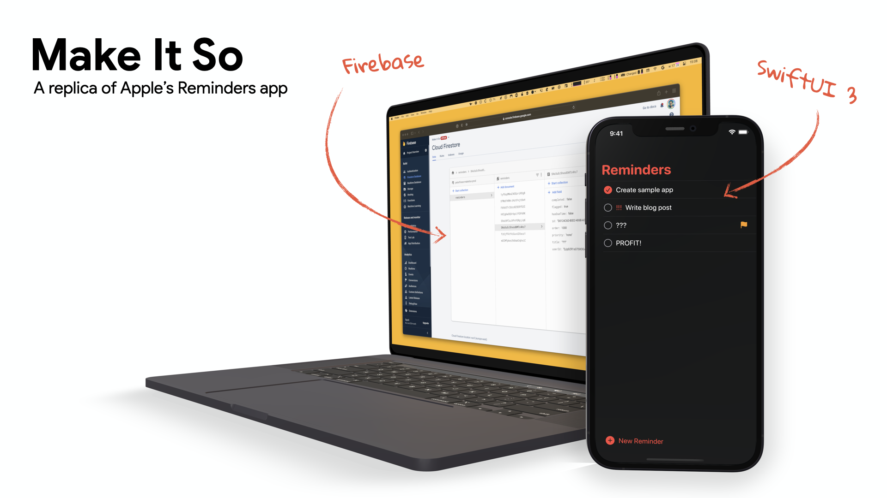

# Reminders 2.0

**Developer:** Alex Yang
## Description
This is a sample app that resembles the capabilities of a functional reminder application, modeled after the iOS Reminders app. The app offers a range of functionalities that make it easy for users to manage their reminders effectively. Users can add reminder items, specify the date and time for each reminder, highlight important reminders with a flag, associate URLs with reminders, and set the priority of each reminder to ensure they stay on top of the most pressing tasks.
The front-end has been developed using SwiftUI in Xcode. The backend uses Firebase and Firestore to store and synchronize the user data, ensuring that reminders are always up-to-date and accessible.
## References
- **Acknowledgements**: 
  - The codebase is larged cloned from [Make It So](https://github.com/peterfriese/MakeItSo) by [Peter Friese](https://github.com/peterfriese) from [Firebase](https://github.com/firebase). 
  
  - The application icon is based on [Check](https://thenounproject.com/term/check/1905028/) by [Robert Won](https://thenounproject.com/robertwon/) from the [Noun Project](https://thenounproject.com/)
- [Orginal Youtube Tutorial](https://goo.gle/39UUab3): I started the project by watching this and understanding the ccodebase of the application. The first step of the project was to `git clone` the [Make It So](https://github.com/peterfriese/MakeItSo) repo and open it in Xcode.
- [Peter's Twitter thread](https://twitter.com/peterfriese/status/1453467058302291975): I also followed Peter's twitter thread and applied updates to the code. The app was originally created in 2020 and consistently updated based on the changes to the folloiwng verisions of SwiftUI.
- The following Firebase documentation helped a lot during the process of setting up the Firebase project and debugging:
  - [Add Firebase to your iOS project](https://firebase.google.com/docs/ios/setup): I followed this documentation to set up my Firebase environment, create a new firebase project, install Firebase SDKs in Xcode, and add the configuration file (`GoogleService-Info.plist`) to the project. After setting up the Firebase project, I noticed that there wasn't any network traffic coming into the Firebase back-end. After spending some time debugging, I realized that the `Bundle ID` needs to be exactly the same in both the Firebase and Xcode project configuration files.
  - [Get realtime updates with Cloud Firestore](https://goo.gle/2Y54Enl): This document was very helpful in confuguring the Firestore database to achieve realtime updates and storage of user data in the app. 
    - NEED TO DISABLE CORS extensions to enable Firestore: https://stackoverflow.com/questions/52281719/unable-to-use-firestore-for-fresh-projects
  - [Firebase Anonymous Auth documentation](https://goo.gle/2wLa36H): This is also a crucial step since without the anonymous authorization allowed in Firebase, all the incoming REST API requests would be denied.
    - In addition, datebase rules in Firestore need to be altered: https://stackoverflow.com/questions/46590155/firestore-permission-denied-missing-or-insufficient-permissions

## Instructions

This app requires a Firebase project, which you can create at no cost using the [Firebase Console](https://console.firebase.google.com). Here are the steps. For a more detailed description of how to add Firebase to an iOS project, refer to the [official Firebase docs for iOS and Apple's other platforms](https://firebase.google.com/docs/ios/setup).
1. Clone the repo
   - [Links to the SwiftUI repo](https://github.com/AlexanderHYang/reminders-ios-app)
2. Create a Firebase project
3. Create a Cloud Firestore database in the new Firebase project ([link](https://console.firebase.google.com/project/_/firestore/))
4. Enable Anonymous Authentication ([link](https://console.firebase.google.com/project/_/authentication/providers))
5. Register the iOS app in the Firebase project
6. Download the `GoogleService-Info.plist` file to the `code/frontend/Configuration/Firebase/Development` folder
7. Open `MakeItSo.xcodeproj` in Xcode
8. Select the `MakeItSo (iOS) DEV` target
9.  Run the app

## Collaboration
In this project, I mostly collaborated with my friend [Vivek Mhatre](https://github.com/VAM7686), who helped me improve the UI and applied some minor changes to the code. The development process was pretty straight-forward without much planning since the tutorials and documentations I found were very detailed and nicely-written. 
Throughout the development process, I learned the value of collaboration and seeking assistance when facing issues. Consulting others who may have gone through similar struggles can be a highly effective solution, as it saves time and resources that would otherwise be spent endlessly searching through documentation or attempting to debug on one's own. Seeking help from others can not only lead to faster resolution of problems, but also foster a sense of community and shared knowledge among developers.